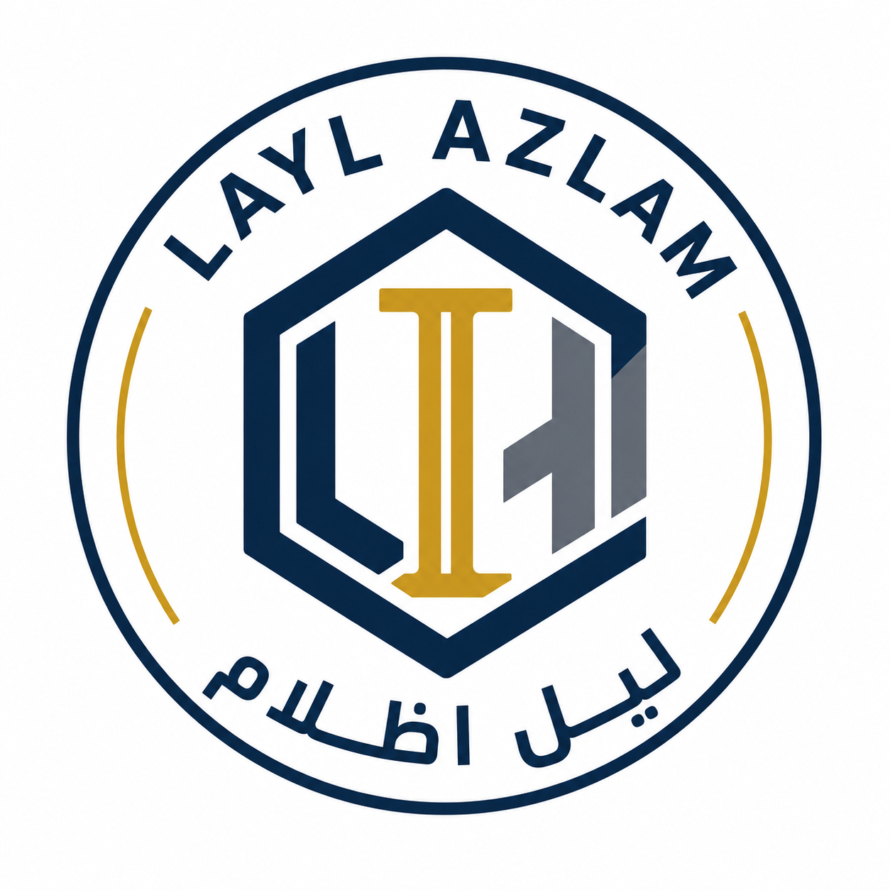

<p align="center">
  
</p>

<h1 align="center">Layl Azlam Establishment</h1>
<p align="center"><em>مؤسسة ليل أظلام</em></p>

<p align="center">
  A diversified, owner-managed business based in Al Jubail, Eastern Province, Saudi Arabia —
  spanning construction, manpower supply, food processing, transport, and hospitality.
</p>

---

## About the Company

Layl Azlam Establishment operates under an active commercial registration with the Saudi
Ministry of Commerce (**CR No. 7054761163**), based in the Al Safat district of Al Jubail.
Built with a deliberately broad foundation, it spans five distinct divisions to give clients
one dependable partner across the Eastern Province:

| Division | Description |
|---|---|
| 🏗️ **Construction & Contracting** | New-build residential construction, renovation, and demolition services. |
| 👷 **Manpower Supply** | Skilled trades, general labour, and supervisory staffing support. |
| 🥫 **Food Processing & Preservation** | Preservation of meat and fish products, and production of fruit juices. |
| 🚚 **Transport & Logistics** | Passenger, freight, livestock, and vehicle transport services. |
| 🏨 **Hospitality & Accommodation** | Hotel operations and serviced apartments for extended stays. |

Proud to support **Saudi Vision 2030**.

## About This Repository

This repo contains the source code for the company's public website — a fast,
dependency-free static site with no build step required.

### Site structure

```
layl_azlam_company/
├── index.html              Home
├── about.html               About / owner's message / core values
├── services.html            The five divisions in detail
├── contact.html              Contact form, map, phone & WhatsApp
├── blog/
│   ├── index.html           Blog listing
│   └── *.html                Individual posts
├── 404.html                  Custom not-found page
├── assets/
│   ├── css/style.css         All site styling (single stylesheet, CSS custom properties)
│   ├── js/main.js             Mobile nav, sticky header, contact form UX
│   └── images/                 Site imagery (see assets/images/README.md)
├── robots.txt
└── sitemap.xml
```

### Tech stack

- Plain **HTML5 / CSS3 / vanilla JavaScript** — no framework, no build tools, no dependencies
- [Google Fonts](https://fonts.google.com/): Playfair Display, Inter, Noto Kufi Arabic
- Bilingual copy (English + Arabic) throughout

### Running it locally

No build step — just open the files in a browser, or serve them locally:

```bash
# Option 1: just open it
open index.html          # macOS
start index.html         # Windows

# Option 2: serve locally (recommended, so relative paths behave like production)
npx serve .
# or
python -m http.server 8000
```

> **Note:** the contact form is currently front-end only (see `assets/js/main.js`) —
> it shows a confirmation message but does not send email yet. Wire it up to a service
> like Formspree or Netlify Forms once hosting is finalized.

## Contact

- **Phone / WhatsApp:** [+966 55 358 5140](tel:+966553585140)
- **Address:** Al Oqair Street, Al Safat District, Al Jubail, Eastern Province, Saudi Arabia
- **CR No.:** 7054761163

---

<p align="center">&copy; 2026 Mo'assasat Layl Azlam (مؤسسة ليل أظلام). All rights reserved.</p>
